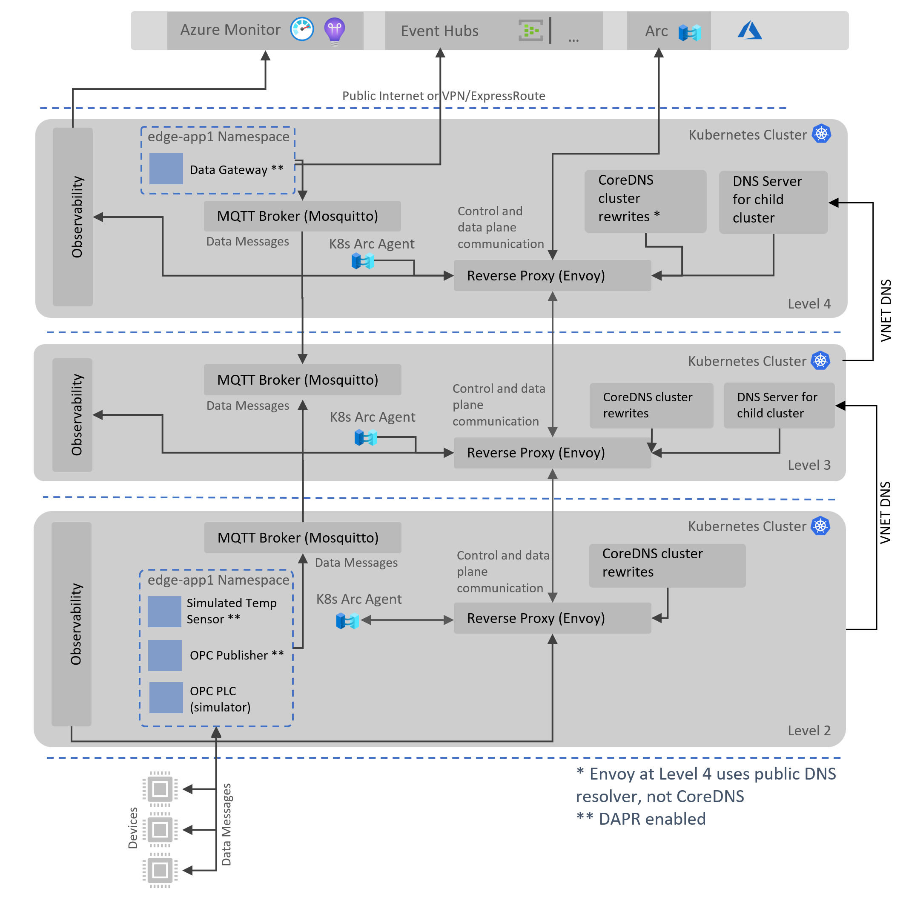

# Distributed Azure IoT Workload Accelerator for K8s

Edge computing comes in various forms, the spectrum of compute scale can vary hugely between use cases and industries. At the lower end of scale we have constrained devices like MCU (Micro Controller Units) and on the higher end we have heavy compute infrastructure which is processing images and high throughput data streams for anomalies. The latter is more frequent in manufacturing industry, these customers often provision high-density hosting platforms on the edge to deploy both cloud connected and locally managed workloads.

Azure IoT Edge provides an easy on-ramp experience for light weight edge compute scenarios, if you do not need to scale-out or have a constraint to use Kubernetes(K8s), please consider using [Azure IoT Edge](https://azure.microsoft.com/en-gb/services/iot-edge/) product instead. In fact, the path could be progressive i.e. customers may start small with single machine/industrial PC using Azure IoT Edge and progress to more scalable platform like Kubernetes later when the use-cases/adoption grows in/organically or the gravity towards it increases due to other collective reasons. If portability is the primary reason for running edge workloads on K8s, please consider using [KubeVirt approach](https://github.com/azure-samples/IoT-Edge-K8s-KubeVirt-Deployment) to deploy IoT Edge in a supported manner.

This repo provides an accelerator and guidance to enable those customer who wants to build edge solutions on K8s in a scalable and resilient manner. The solution makes use of native K8s constructs to deploy and run edge workloads. Additionally, the solution provides a uniform remote management/deployment plane for workloads which is provided via Azure Arc.

## Overall Design

Following diagram shows the abstracted view of the overall solution approach:

Each pod contains two containers:

1. A custom code container running code/logic as defined by the developers.
2. A Dapr sidecar container which works as proxy to Dapr services and ecosystem.

Apart from the above arrangement, the following system modules/pods are part of the solution:

1. **Data Gateway Module**, purpose of this module/pod is to route messages from pub-sub layer to the configured data store(s) in the cloud. This module is deployed on the top layer of the network (enterprise layer).
2. **OPC UA Publisher Module**, OPC UA Publisher module to connect to OPC UA Plc module which simulates downstream devices/hubs in industrial IoT scenarios. 
3. **OPC UA Plc Module**, OPC UA Plc module to simulate OPC UA telemetry from downstream devices to OPC UA Publisher module in industrial IoT scenarios.
4. **Simulated Temperature Sensor Module**, emits random temperature and pressure telemetry for testing purposes in a non OPC UA protocol.

## Nested Topology

This section describes the nested topology design implemented by this solution.

At the core of the nested topology design, we have proxies (currently Squid) which broker the connections between each hypothetical ISA-95 level (Level 2, 3 ,4 in this instance).
These proxies prevent workloads and Arc agents running at lower levels from connecting to the outside world directly, allowing the traffic to be managed/controlled via proxy configuration at each level. 

For the data plane (MQTT PubSub), each layer can only talk to the layer above and never directly to the cloud except for the top (enterprise) layer which has outgoing Internet connectivity.

## Technology Stack

The accelerator makes use of the following products and services:

### Azure Arc

[Azure Arc](https://docs.microsoft.com/en-us/azure/azure-arc/overview) enables the remote control plane for edge platform and provides the following inherent benefits:

1. Remote management plane for K8s cluster on the edge, including host management.
2. Desired state management for edge workloads, using Azure Arc's Flux CD extension in conjunction with K8s native constructs.
3. Standard application deployment model using K8s native constructs i.e. Helm/Kustomize.
4. Uniform deployment plane for both edge and other workloads on K8s.
5. Access to K8s cluster in offline mode via industry standard tools like Helm.

### Distributed Application Runtime ([Dapr](https://dapr.io/))

Dapr building blocks enable the cross-cutting amd non functional features which we are common in edge scenarios, some of those are mentioned below:

1. Local messaging with pub-sub functionality, optionally using standard [CloudEvents](https://cloudevents.io/).
2. Resilient communication between services and cloud endpoints, using [Circuit-breaker](https://docs.microsoft.com/en-us/azure/architecture/patterns/circuit-breaker) pattern.
3. Low latency and high throughput based service invocations, using [gRPC](https://grpc.io/) or Http RESTful mechanism.
4. Secure service to service communication, using mTLS or [SPIFFE](https://spiffe.io/docs/latest/spiffe-about/overview/).
5. Well known and understood configuration and secret management.
6. End to end observability at both application and platform level, using OpenTelemetry.

### MQTT Broker for Publish/Subscribe

Workloads exchange messages locally on the same network layer and cluster by using a cluster-wide deployed MQTT broker. As described above, DAPR is leveraged to interact with the broker without specific application-aware code to interact with the chosen PubSub mechanism.

For more information about MQTT broker choice and comparison, please see [MQTT Broker for data communication between workloads, and between network layers](/docs/mqttbroker.md).

## Solution Deployment

Solution components are split into three layers from deployment perspective:

1. **Core Infrastructure Layer** (Kubernetes, Kubectl/Helm clients configuration).
   This deployment is a responsibility of customer's infrastructure team, customer may already have this infrastructure in place or may need to cater for specific requirements due to external constraints. Pre-Built Packages Available:
    * Core Infrastructure Package for Demo on Azure cloud.
  
2. **Core Platform Layer** (Dapr, Arc and Flux extensions on Kubernetes).
   This deployment is a responsibility of customer's devops team, we will provide a pre-built deployment package/scripts which can be run by customer to create resources (Core Platform Components) in the Kubernetes cluster. Pre-Built Packages Available:
    * Core Platform Package for Kubernetes in Cloud/On-prem.
  
3. **Application Layer** (Cloud and Kubernetes artifacts for the application).
   This deployment is a responsibility of customer's devops team, customer will use scripts to deploy application components which may span across Azure (App1 RG) and Kubernetes on the edge (App1 Namespace). The edge component will comprise of a Flux configuration manifest which in turn will configure Flux extension on Kubernetes to sync and deploy remote/local Helm package. Pre-Built Packages Available:
    * Sample Application Package for Accelerator in Cloud/Hybrid mode.

Deployment of the above artifacts may require multiple tools, this is where we can potentially attempt to make use of [CNAB bundles and Porter](https://porter.sh/). Porter can package Helm charts, az cmds and other scripts to deploy the solution and its dependencies.

### Try It on Azure

In Azure, for demo purposes we deploy all the three layers for you.

Run the following cmdline in [Azure Cloud Shell](https://shell.azure.com/powershell) (PowerShell):

`Invoke-WebRequest -Uri "https://raw.githubusercontent.com/azure-samples/distributed-az-edge-framework/main/deployment/deploy-az-demo-bootstrapper.ps1" -OutFile "./deploy-az-demo-bootstrapper.ps1" && ./deploy-az-demo-bootstrapper.ps1`

Optionally, for deploying a developer environment with local application building and deployment please see [Setup a developer environment on Azure with local application deployment](./deployment/deploy-dev.md).

## Further Enhancements

This solution is further enhanced with the features/issues defined here [here](https://github.com/Azure-Samples/distributed-az-edge-framework/issues)

## Disclaimer

This project has been created to accelerate the development of heavy edge solution on Kubernetes.
No guarantees can be offered as to response times on issues, feature requests, or to the long term road map/support for the project.

Taking the above statement into account the team involved in this effort wish for the project to evolve into a stable, production ready resource with active contributors from Microsoft and the wider community.

This project uses GitHub Issues to track bugs and feature requests. Please search the existing issues before filing new issues to avoid duplicates. For new issues, file your bug or feature request as a new Issue.
