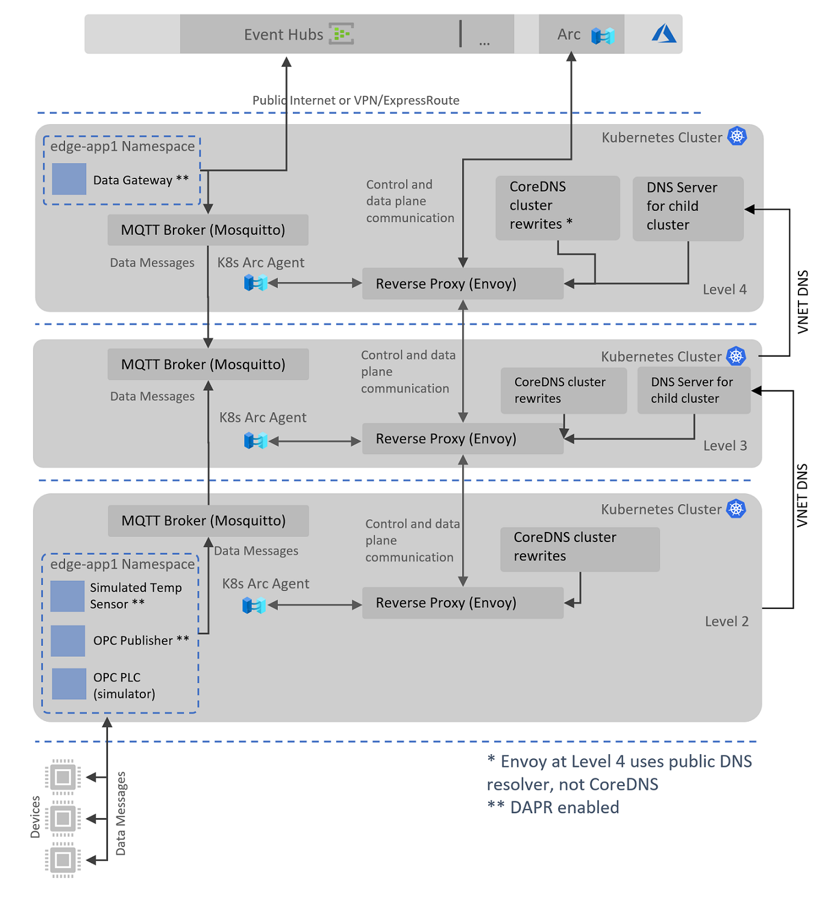
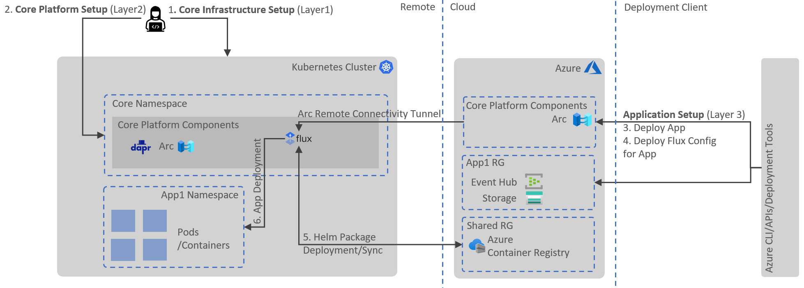

# Distributed Azure IoT Workload Accelerator for K8s

Edge computing comes in many forms and the spectrum of compute scale vary between use cases and industries. At the lower end of scale are constrained devices like MCU (Micro Controller Units) and on the higher end is heavy compute infrastructure. Heavy edge infrastructure is appropriate for high throughput data processing or intensive ML/AI workloads. Across the manufacturing industry the provisioning of high-density hosting platforms on the edge is quite common as it facilitates more unified development and deployment of cloud and edge based workloads.

Azure IoT Edge provides an easy on-ramp experience for light weight edge compute scenarios, if you do not need to scale-out or have a constraint to use Kubernetes, please consider using [Azure IoT Edge](https://azure.microsoft.com/en-gb/services/iot-edge/). Do keep in mind however, the path to a Kubernetes-based edge environment can be progressive; i.e. organizations may start small with single machine/industrial PC using Azure IoT Edge and progress to more scalable platform later when the use-cases or deployment footprint grows. If portability is the primary reason for running edge workloads on Kubernetes, please consider using our [KubeVirt solution](https://github.com/azure-samples/IoT-Edge-K8s-KubeVirt-Deployment) to deploy IoT Edge into a Kubernetes environment (this is also an attractive way to migrate from IoT Edge on bare metal to a larger scale, cluster-based solution).

This repo provides an accelerator and guidance to enable organizations to build edge solutions on K8s in a scalable and resilient manner. The solution makes use of native Kubernetes constructs to deploy and run edge computing workloads. Additionally, the solution provides a uniform remote management and deployment plane for workloads, provided via Azure Arc.

## Overall Design

Following diagram shows the abstracted view of the overall solution approach:

Each pod contains two containers:

1. A custom code container running business logic, as defined by the developers
2. A Dapr sidecar container which works as proxy to the Dapr services and ecosystem

Apart from the above arrangement, the following system modules/pods are part of the solution:

1. **Data Gateway Module**, purpose of this module/pod is to route messages from pub-sub layer to the configured data store(s) in the cloud. This module is deployed on the top layer of the network (L4 layer)
2. **OPC UA Publisher Module**, OPC UA Publisher module to connect to OPC UA PLC module which simulates downstream devices/hubs for industrial IoT scenarios
3. **OPC UA PLC Module**, OPC UA PLC module to simulate OPC UA telemetry from downstream devices to the OPC UA Publisher module for industrial IoT scenarios
4. **Simulated Temperature Sensor Module**, emits random temperature and pressure telemetry for testing purposes in a non-OPC UA protocol

## Nested Topology

This section describes the nested topology design implemented by this solution.

At the core of the nested topology design, we have reverse proxies which broker the connections between each hypothetical ISA-95 level (Level 2,3,4 in this instance). These proxies prevent workloads and Arc agents running at lower levels from connecting to the outside world directly, allowing the traffic to be managed or controlled via proxy configuration at each level. Currently, data plane is tranversing layers directly between brokers, and we are evaluating an improvement to force this communication to pass through the proxy transparently. 
Proxying of allowed URI calls from the lower L2 and L3 levels for the AKS host nodes (kubelet, containerd) is implemented using a DNS Server override in each lower Virtual Network.

For more information about the network topology and usage of Envoy reverse proxy please see the detailed document: [Network Separation and Reverse Proxy](./docs/reverseproxy.md).

## Technology Stack

The accelerator makes use of the following products and services:

### Azure Arc

[Azure Arc](https://docs.microsoft.com/en-us/azure/azure-arc/overview) enables the remote control plane for edge platform and provides the following inherent benefits:

1. Remote management plane for a Kubernetes cluster on the edge, including host management
2. Desired state management for edge workloads using Azure Arc's Flux CD extension in conjunction with Kubernetes native constructs
3. Standard application deployment model using Kubernetes native constructs i.e. Helm/Kustomize
4. Uniform deployment plane for both edge and other workloads on Kubernetes
5. Access to Kubernetes cluster in offline mode via industry standard tools like Helm

### Distributed Application Runtime ([Dapr](https://dapr.io/))

Dapr building blocks enable the cross-cutting amd non functional features which we are common in edge scenarios, some of those are mentioned below:

1. Local messaging with pub-sub functionality, optionally using standard [CloudEvents](https://cloudevents.io/)
2. Resilient communication between services and cloud endpoints using the [Circuit-breaker](https://docs.microsoft.com/en-us/azure/architecture/patterns/circuit-breaker) pattern
3. Low latency and high throughput based service invocations using [gRPC](https://grpc.io/) or Http ReST mechanics
4. Secure service-to-service communication using mTLS or [SPIFFE](https://spiffe.io/docs/latest/spiffe-about/overview/)
5. Well known and understood configuration and secret management approaches
6. End-to-end observability at both application and platform levels using [OpenTelemetry](https://opentelemetry.io/)

### MQTT Broker for Publish/Subscribe and Data Plane Bridging

Workloads exchange messages locally on the same network layer and Kubernetes cluster by using a cluster deployed MQTT broker. As described above, Dapr is leveraged to interact with the broker without specific application-aware code to interact with the chosen PubSub mechanism.

For more information about MQTT broker choice and comparison, please see [MQTT Broker for Data Communication Between Workloads and Between Network Layers](/docs/mqttbroker.md).

## Solution Deployment

Solution components are split into three layers from deployment perspective:

1. **Core Infrastructure Layer** (Kubernetes, Arc, Kubectl/Helm clients configuration).
   This deployment is a responsibility of an organization's infrastructure team. Organizations may already have this infrastructure in place or may need to cater for specific requirements due to external constraints. Pre-Built Packages Available:
    * Core Infrastructure Package for Demo on the Azure Cloud.
  
2. **Core Platform Layer** (Dapr, Mosquitto, and Flux extensions on Kubernetes).
   This deployment is a responsibility of an organization's devops team. Pre-built deployment packages/scripts are provided which can be run by an organization to create resources (Core Platform Components) in the Kubernetes cluster. Pre-Built Packages Available:
    * Core Platform Package for Kubernetes in Cloud/On-prem.
  
3. **Application Layer** (Cloud and Kubernetes artifacts for the application).
   This deployment is a responsibility of organizations's devops team. The provided scripts will deploy application components which may span across Azure (App1 RG) and Kubernetes on the edge (App1 Namespace). The edge component is comprised of a Flux configuration manifest which in turn will configure the Flux extension on Kubernetes to sync and deploy remote/local Helm packages. Pre-Built Packages Available:
    * Sample Application Package for Accelerator in Cloud/Hybrid mode.

Deployment of the above artifacts may require multiple tools, this is where we can potentially attempt to make use of [CNAB bundles and Porter](https://porter.sh/). Porter can package Helm charts, `az` cmds and other scripts to deploy the solution and its dependencies.

## Try It on Azure

### Easy Setup via Azure Cloud Shell

**Pre-requisites**
- Azure subscription
- Azure permissions: `Owner` on the subscription (permissions to create Service Principals, provision resources and update RBAC on the resources)

**Default Deployment**

In Azure, for demo purposes we deploy all the three layers for you, Arc-enabling the clusters and deploying sample workloads to simulate messaging activities.

Run the following command in the [Azure Cloud Shell](https://shell.azure.com/powershell) (PowerShell):

`Invoke-WebRequest -Uri "https://raw.githubusercontent.com/azure-samples/distributed-az-edge-framework/main/deployment/deploy-az-demo-bootstrapper.ps1" -OutFile "./deploy-az-demo-bootstrapper.ps1" && ./deploy-az-demo-bootstrapper.ps1`

Optionally, for deploying a developer environment with local application building and deployment please see [Setup a development environment on Azure with local application deployment](./deployment/deploy-dev.md).

### Validate Deployment

After successful deployment, the following resources will be created in your Azure subscription:
- Three resource groups with each having their own AKS cluster, separate and peered virtual networks and Azure Arc connected.
- One resource group with Event Hub resource. Messages from the edge workload simulators will be published to this Event Hub.
- All resources will be provisioned in West Europe region. 

Within the sample AKS clusters, several workloads are deployed as depicted in the [Nested Topology](#nested-topology) section above. Application workloads are deployed using Arc's Flux extension (GitOps).
The lower networks are denied outbound internet access and have to route traffic through to the upper layers until it reaches public internet on Level 4.

To validate the deployment of the default resources and sample workloads you can validate a few things:

- In Azure: 
    - Review the new resource groups and their configuration. The resource groups will all be prefixed with the `ApplicationName` you supplied when running the script.
    - Go to the Azure Event Hub in the `<ApplicatioName>-App` resource group and validate messages are coming through.
- In Azure Cloud Shell CLI, use `kubectl` commands to review deployed workloads:
    - Connect to the desired AKS cluster by running `az aks get-credentials --resource-group <ApplicationName>L4 --name aks-<ApplicationName>L4` (`L4` can be replaced by `L3` or `L2`). 
    - Connect to L4 cluster and run the following command to see messages are being published to Event Hubs:
        - Get the pods in `kubctl get pods -n edge-app1`
        - Get the logs for the Data Gateway module: `kubectl logs -l app=data-gateway-module -n edge-app1`. You should see some logs about messages published.
    - You can also further view other workloads by reviewing deployments in the namespaces `edge-core`, `edge-infra` and `azure-arc`.
    - Connecto the L2 cluster and review the application (and their logs) deployed to `edge-app1` namespace.

### Clean-up Resources

> **Warning**
> Please ensure you delete the deployed Azure resources after testing. Azure deployed resources will be charged into your subscription and can run up due to multiple AKS clusters being provisioned.

`Invoke-WebRequest -Uri "https://raw.githubusercontent.com/azure-samples/distributed-az-edge-framework/main/deployment/remove-dev-resources.ps1" -OutFile "./remove-dev-resources.ps1" && ./remove-dev-resources.ps1 -ApplicationName <ApplicationName>`

Where `<ApplicationName>` is the name you entered when invoking the initial provisioning scrip.

## Further Enhancements

This solution is further enhanced with the features and issues defined [in our issue list](https://github.com/Azure-Samples/distributed-az-edge-framework/issues).

## Disclaimer

This project has been created to accelerate the development of heavy edge solution on Kubernetes.
No guarantees can be offered as to response times on issues, feature requests, or to the long term road map/support for the project.

Taking the above statement into account the team involved in this effort wish for the project to evolve into a stable, production ready resource with active contributors from Microsoft and the wider community.

This project uses GitHub Issues to track bugs and feature requests. Please search the existing issues before filing new issues to avoid duplicates. For new issues, file your bug or feature request as a new Issue.
