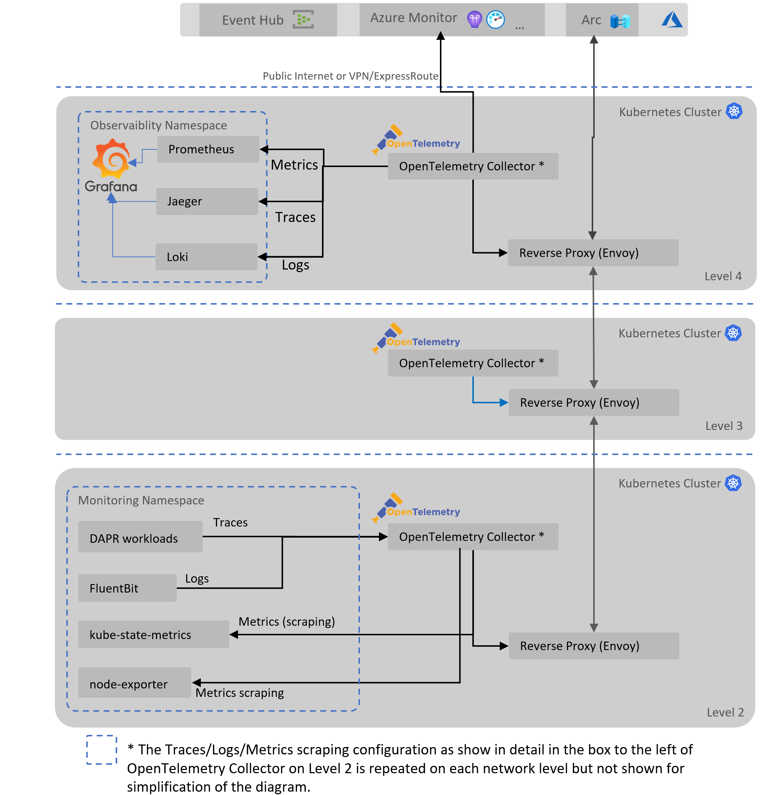

# Observability for Distributed Edge

To understand how an application is behaving, it's key to integrate observability into the application end to end. Observability refers to the ability to gain insights into the internal workings of a system, while monitoring involves collecting and analyzing data to ensure the system's health and performance.

When we discuss monitoring, we typically refer to signals captured from all running systems, be it OS, databases, custom workloads and Kubernetes platform itself. The types of signals are typically split into:

- Logs
- Traces
- Metrics



## Edge-specific Requirements

Capturing signals is done primarily at the edge due to the architecture of this sample. Having only a few components like Event Hubs and Azure Container Registry as current cloud resources, the bigger portion of the observability solution needs to run on the edge.

In addition to the observability stack deployment to measure, analyze and act on monitoring of the platform, the edge comes with some additional challenges. Special network topology with restricted access between network layers, occasionally disconnected scenarios and sometimes need for a local-only or at least locally available copy of the solution to address longer periods of cloud network losses. Local persistence and queuing of data in case of prolonged connectivity loss is an additional complexity.

This solution starts by addressing network topology requirements by building on top of the [nested proxy with Envoy solution](./reverseproxy.md), and aggregate the monitoring solution in the cloud. At the edge there is a local optional observability stack deployed to offer edge based visualization of the signals through Grafana.

## OpenTelemetry

With Microsoft's commitment to embrace OpenTelemetry in its Azure Monitor products - [Azure Monitor Application Insights - OpenTelemetry](https://learn.microsoft.com/en-us/azure/azure-monitor/app/opentelemetry-overview#opentelemetry) - this sample is taking a dependency on this open-source, industry supported telemetry instrumentation technology.

OpenTelemetry consists of two functionalities:

- OpenTelemetry Protocol (OTLP)
- OpenTelemetry Collector

### OpenTelemetry Kubernetes Operator

The OpenTelemetry Operator manages OpenTelemetry Collector and allows for auto-instrumentation of code in different languages. When configuring `receivers` that are standard extensions, the operator ensures ClusterIP services are created automatically within the cluster, minimizing custom setup within the deployment approach with custom Helm charts.

Evaluation is still ongoing whether it adds value in this solution to use the Operator, versus managing the Collector directly. The main reason for not using Operator today is the lack of needs for auto-instrumention injection as all custom workloads leverage Dapr which has its own set of monitoring options already integrated.

OpenTelemetry Collector Deployment Options

- Deployment
- DaemonSet
- StatefulSet
- Sidecar

### Azure Monitor Exporter for OpenTelemetry

This exporter is part of OpenTelemetry-Collector-contrib repo, and is in beta at time of writing.

Details: [Azure Monitor Exporter](https://github.com/open-telemetry/opentelemetry-collector-contrib/tree/main/exporter/azuremonitorexporter).

Refer to the documentation to get a better understanding of how mapping of attributes works, and in which tables the traces, logs and metrics are stored in Azure Application Insights.

| OpenTelemetry | Azure App Insights |
|----------|----------|
| Traces | dependencies |
| Metrics | customMetrics |
| Logs | traces |
| Exception trace events | exception |

### Fluent Bit and OpenTelemetry

Logs in the Kubernetes components and custom workloads are collected using Fluent Bit, installed via a `DaemonSet`` on each node of the cluster. It is configured to scrape all logs, and using Fluent Bit's ['OpenTelemetry output plugin'](https://docs.fluentbit.io/manual/pipeline/outputs/opentelemetry), it automatically forwards all logs into the OpenTelemetry collector's HTTP OTLP endpoint.

### Edge Metadata Enrichment of Logs, Metrics and Traces

When emitting and collecting signals in out of the box scenarios and not enriching signals through an SDK, the data collected will contain no specific information about the Kubernetes cluster monitored. There might be some information injected by some of the tooling like Fluent Bit logs, but when looking at Prometheus metrics there will be no reference to which cluster this pertains to.

In edge computing scenarios you may want to aggregate monitoring data across the three (or more) networking layers, as well as aggregating across different edge locations. OpenTelemetry offers a few solutions for enriching signals by leveraging `Processors` like [`Resource`](https://github.com/open-telemetry/opentelemetry-collector-contrib/tree/main/processor/resourceprocessor) and [`Attributes`](https://github.com/open-telemetry/opentelemetry-collector-contrib/blob/v0.81.0/processor/attributesprocessor/README.md).

In this sample we deploy a three layered network topology and want to understand the aggregated logs in Azure Monitor. To achieve this we leverage these custom processors to enrich the signals as they get exported per layer.
Based on the spec, using the `Action` of `insert` ensures the key is added if not yet existent. When a lower level OpenTelemetry Collector moves its signals through the different levels, existing attributes will not be overwritten thus ensuring each original signal only receives the new metadata at time of first export from the initial location.

Today metadata such as `edge.layer`, `edge.region` and `k8s.cluster.name` are inserted and configured at installation time by providing custom values to the Helm chart.
There are also other options to automatically add attributes, such as Environment Variables through the [`Resource Detection Processor`](https://github.com/open-telemetry/opentelemetry-collector-contrib/blob/main/processor/resourcedetectionprocessor/README.md).

```yaml
processors:
  
  resource:
    attributes:
    - key: edge.layer
      value: {{ .Values.metadata.networkLayer }}
      action: insert
    - key: edge.region
      value: {{ .Values.metadata.region }}
      action: insert
    - key: k8s.cluster.name
      value: {{ .Values.metadata.clusterName }}
      action: insert
```

Updating these values after initial Helm chart installation can be achieved by executing `helm upgrade`.

Within Azure Application Insights the added attributes are available in `customDimensions` array and can be further used to query the logs, metrics and traces.
Example of a log entry in the `traces` table in App Insights, customDimensions:

```json
{
    "cpu":"1",
    "edge.layer":"L4",
    "edge.region":"northeurope",
    "k8s.cluster.name":"[-myclusterdeploymentname-]",
    "http.scheme":"http",
    "instrumentationlibrary.name":"otelcol/prometheusreceiver",
    "instrumentationlibrary.version":"0.81.0",
    "k8s.container.name":"node-exporter",
    "k8s.daemonset.name":"otelcollection-prometheus-node-exporter",
    "k8s.namespace.name":"monitoring",
    "k8s.node.name":"[...]",
    "k8s.pod.name":"otelcollection-prometheus-node-exporter-xxx",
    "k8s.pod.uid":"[...]",
    "net.host.name":"[...]",
    "net.host.port":"9100",
    "service.instance.id":"..:9100",
    "service.name":"node-exporter"
}
```

### OpenTelemetry Support in Components of the Solution

This section contains a number of relevant resources of (initial) built-in OpenTelemetry support for some of the technologies used in this sample.

- **Envoy Proxy**:
  - Envoy Proxy has built-in support for OpenTelemetry tracing, but since it relies on TLS termination it's not being implemented in this sample.
  - Prometheus compatible metrics endpoint is available but requires some special configuration to expose it under its default `/metrics` URI. This special configuration can be observed in Envoy's Helm chart, under the listener named `envoy-prometheus-http-listener` in the configmap.
- **Dapr**: out of the box support for OpenTelemetry tracing and Prometheus metrics scraping. The current implementation uses `Zipkin` endpoint on OpenTelemetry to push traces from Dapr components to OpenTelemetry.
- **Mosquitto** - Mosquitto does not have any native support for metrics or traces with OpenTelemetry. Logs however can be extracted by integrating with Fluent Bit which will collect logs automatically based on annotations. Trace context propagation is not available on the broker, contrary to some of the other open source brokers. There is an initial [draft spec for standardizing W3C Tracing in MQTT](https://w3c.github.io/trace-context-mqtt/).
- **Kubernetes**: there is extensive support for OpenTelemetry in Kubernetes environments, including the OpenTelemetry Operator, Helm charts for collector and [extensive documentation](https://opentelemetry.io/docs/kubernetes/).

## Local Observability Visualization

Within the edge solution, on Level 4 of the network topology, a set of components are deployed to offer local visibility to the observability data. This is done by leveraging open source components such as Grafana, Tempo, Jaeger and Loki.

In order to view explore the data through the Grafana dashboard and data sources, you can use port-forwarding to access the endpoint:

```bash
# First identify the name of the grafana pod in the observability namespace

kubectl port-forward grafana-xxx-xxx 3000:3000 -n observability

```

After forwarding the port you can open Grafana dashboard by going to [http://localhost:3000](http://localhost:3000).

## Future Additions and Explorations

- Remotely configuring log levels
- Solution to ensure log levels are set back to warning after specified period of time especially if the cluster would go offline
- Edge persistence storage queue between edge and Azure Monitor. This will prevent data loss in case of (prolonged) connectivity issues to the cloud
- Custom workload observability: evaluate usage of OpenTelemetry auto-instrumentation and adding application specific tracing and logging instead of default Dapr observability
- Add TLS to OpenTelemetry Collectors for traffic between the network layers
