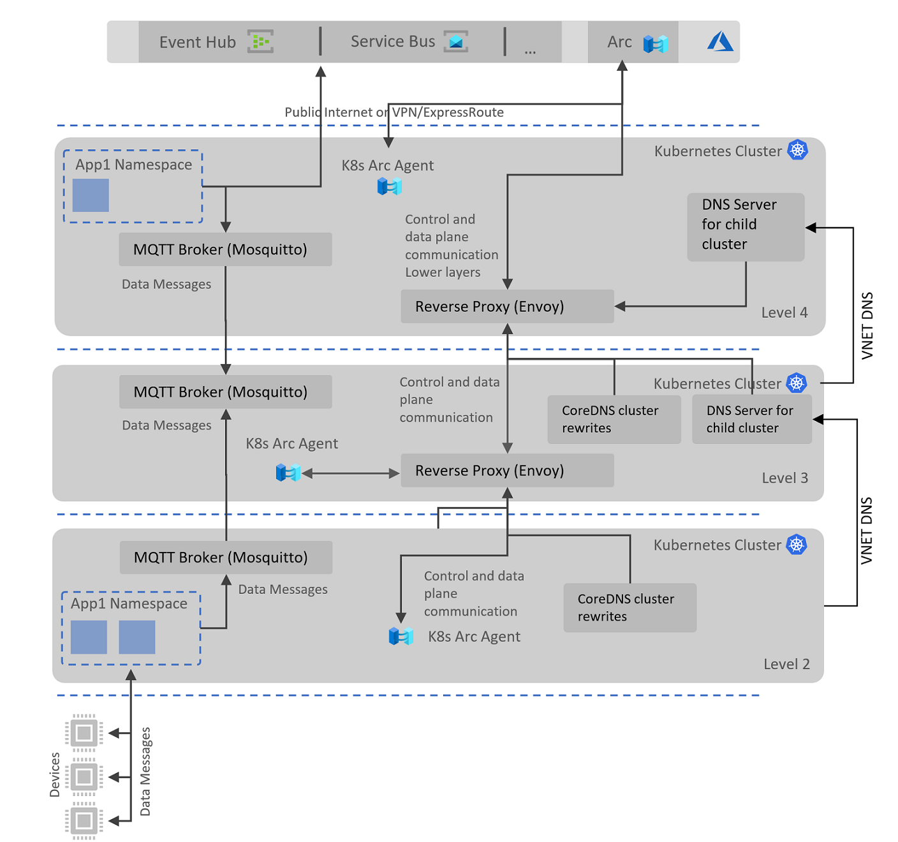

# Network Separation and Reverse Proxy

In various edge infrastructure setups, particularly in manufacturing, applications operate in separate and regulated network layers. To accommodate for this, this sample uses a nested network topology design in which each layer can only communicate with the layer immediately above it, rather than directly with the Internet.

For traffic that requires cloud-based resources, such as Azure Arc services, a reverse proxy is employed to facilitate the requests through each layer until they reach the topmost layer proxy. The topmost layer proxy is configured to determine which traffic is permitted through and to which destination it should be directed. This setup allows customers to modify the configuration of the proxy at each level to gain customized control over incoming and outgoing requests.

Types of requests:
- Azure Arc resources to enable Azure Arc enabled Kubernetes
- GitOps repos
- Container registry locations
- Azure cloud services at the topmost level: data services like Event Hubs

## Envoy Proxy

This implementation uses the [Envoy proxy](https://www.envoyproxy.io/), an open-source solution known for its strength and popularity. Envoy provides L3/L4 network proxy capabilities, and L7 HTTP networking features.

To enable this, Envoy is configured to listen to a predetermined set of domain names that it recognizes and can route through the various network layers until it reaches the internet.

The L3/L4 TCP filter is employed to capture incoming traffic and redirect it upwards in this ISA 95-like topology:

- At Level 2 of the network topology, Envoy listens for incoming traffic matching a set of predetermined domain names and forwards it to the incoming endpoint of the proxy at Level 3.
- At Level 3, Envoy has an identical setup as the proxy at Level 2, forwarding all traffic up to Level 4.
- At Level 4, there is a specific set of listeners and destination clusters. For each authorized domain name, the proxy has a designated destination cluster that directs the traffic to the intended public domain name.

> It worth noting that at Level 4, the Envoy Pod has custom network setup that does not use the rewritten domains by the local CoreDNS in Kubernetes. This guarantees that local address translation within the cluster forwards a set of domain names to the Envoy proxy Endpoint on the same Level 4 cluster. However, Envoy Pod itself resolves public addresses with the Azure or public DNS, overwriting its local DNS resolution to prevent an infinite redirection loop of DNS requests to the proxy itself. This implementation can be seen in the `hostNetwork` and `dnsPolicy` settings of the Envoy deployment manifest (in Helm).

## DNS Rewriting with CoreDNS

Within each cluster, regardless of the cluster's ability to directly access the Internet, CoreDNS is adjusted to modify a predefined set of domain names. This set includes all the fully qualified domain names specified in the Azure Arc Networking Requirements document, as well as some domain names necessary for downloading Helm charts, using GitOps, and accessing container images.

Kubernetes has built-in DNS resolution capabilities for services and pods, as described in this relevant source [document](https://kubernetes.io/docs/concepts/services-networking/dns-pod-service/). CoreDNS is now the most used DNS service for Kubernetes and is available in Azure AKS.

Each service or pod in the Kubernetes cluster is automatically provided with local DNS resolution injection. This enables the resolution of external domain names as well as inter-service domain name resolution.

For modifying some of the domain names that must pass through the Envoy proxy, the CoreDNS plugin model is employed. Customization can be done using the `hosts` and custom `forward` servers.

Upon a successful installation of the Envoy proxy, a load balancer service endpoint listening on port 443 is generated. This internal endpoint is assigned to a set of domain names to be overwritten via the `hosts` and `rewrite` plugin model for CoreDNS. In Azure AKS, this customization is possible but limited, and it can be accomplished through the ConfigMap `coredns-custom`. Please see [Customize CoreDNS with Azure Kubernetes Service](https://learn.microsoft.com/en-us/azure/aks/coredns-custom) for more information.

## Virtual Network Configuration

### Inbound (Ingress) Network Configuration

At the networking level within the Virtual Network, all traffic from lower layers in a peered VNET is allowed through. This can further be locked down and in this case NSGs should permit traffic inbound to upper levels for ports 443 (HTTPS), 8883 (MQTT), 8084 (for Arc) and 53 (custom DNS).

### Outbound (Egress) Network Configuration

Level 2 and Level 3 Network Security Groups have `Allow` rules for outbound traffic to the Virtual Network only. There is a `Deny`` rule for all Internet outbound traffic (except some requirements for Azure, see below).

Level 4 NSG allows all Internet outbound traffic. This could be further restricted using a Firewall or custom default gateway for outbound traffic. 

### Azure Kubernetes Services (AKS) Specific Sample Requirements

This repository utilizes AKS-based clusters to simplify the Azure setup process for the sample, removing the need to focus on the infrastructure setup of Kubernetes. Because AKS is a managed service, there are some specific requirements for outbound network rules that must be applied. It's important to note that these requirements will not apply in a real implementation on the edge without AKS Azure networking.

When bootstrapping a cluster on a lower level, NSG rules are used to allow outbound traffic to specific Azure services and deny all other Internet outbound, except some proxied traffic through reverse proxy. 

As per the documented requirements in [Outbound network and FQDN rules for Azure Kubernetes Service (AKS) clusters](https://learn.microsoft.com/en-us/azure/aks/outbound-rules-control-egress), several Network Security Group outbound rules are added to allow AKS service itself to continue functioning. These include:

- AKS API Server endpoint required for any applications running within the cluster that need to call out to the API on port 443. This applies to some Azure Arc agent services.
- AzureCloud service tag on ports 1194 and 9000.
- MicrosoftContainerRegistry service tag for downloading containers for initial bootstrapping of AKS or upon cluster restart.

### Azure Kubernetes Services (AKS) DNS Resolution for Host System

AKS clusters are deployed with a default DNS resolution configuration that uses the default Azure DNS service. Because the L2 and L3 networks have been denied outbound Internet Access (see above), access to container registries and GitOps repos for usage by the host system (like `kubelet` and `containerd`) also needs to be pointing to go through the Envoy reverse proxy on the above layer.

This is done by using a simple DNSMasq service that is deployed on the L4 and L3 layers. The DNSMasq service is configured to override a set of URLs that are allowed to pass through to the Internet and point them to the Envoy proxy. At L4 only, Envoy proxy is configured to use the Azure DNS service as the upstream DNS resolver.
By updating the Virtual Network DNS setting for L2 and L3 to each use the upstream DNSMasq service, the host system will be able to resolve the URLs that are allowed to pass through to the Internet. 

The reason for a simplified override with DNSMasq is that the DNS configuration is typically something part of customer's architecture and existing setup, so this sample approach works for this Sample sandbox but will not be implemented in a real-world scenario.

## SSL Termination

To maintain a zero-trust security approach, the Envoy reverse proxy does **not** perform SSL termination. This eliminates the need for control between where HTTPS traffic is decrypted and then re-encrypted. By doing so, it reduces the risk of any communication being transmitted in plain text before being re-encrypted again. 

Even though the Envoy TLS Inspector Filter is employed, it does so only to read out the hostname in the SNI. This information is available in the SSL ClientHello which is the TLS handshake first message and sent in unencrypted. In this manner we can use filters based on SNI and proxy the traffic to allowed domain names only (in Envoy *clusters*). 

This topic is still being debated and might change in the future.

## Envoy configuration for top level (L4) dynamic cluster resolution

Azure Arc resources require certain domain names to be allowed for egress, including wildcard domains. However, configuring Envoy for a reverse proxy setup can be challenging when the full domain name is not known upfront. Envoy proxy requires a dynamic cluster endpoint configuration to be set up for such scenarios.

To address this challenge, the current sample uses the SNI Dynamic Forward Proxy solution, which can resolve a number of pre-set wildcard domains. 

> Note: It is important to point out that this feature is currently in an alpha stage and should not be used in production scenarios.

Let's consider an example where both the full domain `gbl.his.arc.azure.com` and the wildcard domain `*.his.arc.azure.com` are required. In the case of the former, we can set up a filter match and a cluster with a full endpoint. However, for the latter, we need to configure a dynamic forward proxy to resolve the dynamic part of the URL.

Envoy applies the filter match chains in the order that they are defined through the `filter_chains` collection. In this example, because the first URL is matched and its cluster destination is set statically, we can control the reverse proxy configuration when the URI is fully known.

## Envoy Helm Chart and Scripted Setup of CoreDNS

We assume that the same persona who manages the cluster will also set up this infrastructure, this is the reason why you will find this section of the deployment in the file [./deployment/deploy-core-infrastructure.ps1](./deployment/deploy-core-infrastructure.ps1).

Before running the deployment, the deployment script prepares the input values for the Envoy Helm Chart. The primary information passed to the chart is a list of custom domains that need to be brokered through to the next layer or Level 4, which is the internet.

Because Envoy's listeners filter based on domain names in the request, the script also ensures that any new deployment or chart update is reflected in the CoreDNS domain rewrites. This domain name rewrite is accomplished by generating the `coredns-custom` ConfigMap with a set of custom `hosts` entries. The script gets all default Helm chart Values and generates input for the `coredns-custom` file.

If you plan to rerun the Helm chart, make sure to run the script or create a new version of the `coredns-custom` ConfigMap to ensure that the DNS rewriting redirects the request to the Envoy proxy endpoint, rather than resolving the domain name publicly.

### Understanding the current deployment script flow (/deployment/deploy-core-infrastucture.ps1)

Based on the different key elements discussed in this document, it's important to give an overview of the different steps automated in the scripts to setup and configure proxying, DNS resolution, VNET networking rules and Azure Arc enabling.

Reviewing the file [deploy-core-infrastucture.ps1](../deployment/deploy-core-infrastructure.ps1) will give you a good understanding of the different steps and how they are automated. Note that this flow is the default flow when installing the demo bootstrapper. For the developer flow it normally does not configure Azure Arc so some steps will be skipped.

## Proxy Placement Design Considerations

In this current implementation, we have chosen to setup the reverse proxy within the Kubernetes cluster for any proxying or forwarding purposes. This allows for better control of domain name resolution with CoreDNS. However, this option has its advantages and disadvantages.

### Advantages
- CoreDNS can be configured to resolve all domain names to the reverse proxy endpoint, which is the Envoy proxy. This allows for a single point of control for all domain name resolution within the cluster.
- If there is a need to locally override a domain name, it can be easily achieved by modifying the CoreDNS configuration.
- Changes to the cluster IP address of the reverse proxy can be easily reflected by updating the CoreDNS configuration within the cluster.

### Disadvantages
- For any AKS/Kubernetes host OS and system-level communication, you still need to configure DNS and proxy settings in the upper layer. Therefore, one might question why not use the same upper layer proxy for all communication instead of configuring both approaches.
- Deployments within the cluster that require internet access may face limitations.
- If the reverse proxy in the upper layer needs to be redeployed, a new load-balanced IP address might be assigned, requiring additional configuration in the lower layer cluster.
- Resolution and proxy through upper layer for all communication offers a simpler setup, both Kubernetes and host system rely on DNS and reverse proxy of the layer above. This provides a single point of control for all domain name resolution and proxying within or outside of the cluster.

As an example to changes in the architecture, we take the same high level architecture as shown on the [Readme](../README.md) but with changes for DNS and proxy directly to the upper layer as follows:

## Design Considerations for Future Extension

- Default gateway for host system (AKS Kubernetes nodes and OS level communication)
- Customer owned firewalls and proxies, and how to integrate with them
- Level 4 CA certificate integration for outbound traffic via customer proxies and firewalls (potentially requiring custom CA certificate trust and user-based authentication)
- Mutual TLS between reverse proxies

## Future Planned Additions in this Sample:

- Wildcard sub-domain redirection: some of the domains required for Azure Arc K8S are documented in the form of wildcard subdomains (*.his.arc.azure.com, *.arc.azure.com, *.data.mcr.microsoft.com, *.guestnotificationservice.azure.com). Currently implemented using SNI dynamic forward proxy in Envoy on L4 out to the internet.
- Integrating with customer owned firewalls and proxies, especially for Internet bound access.
- Level 4 connected (local) container registry for all required container images, including a copy of public images like Envoy and Mosquitto.
- Mosquitto bridging through reverse proxy and no longer directly between layers.
